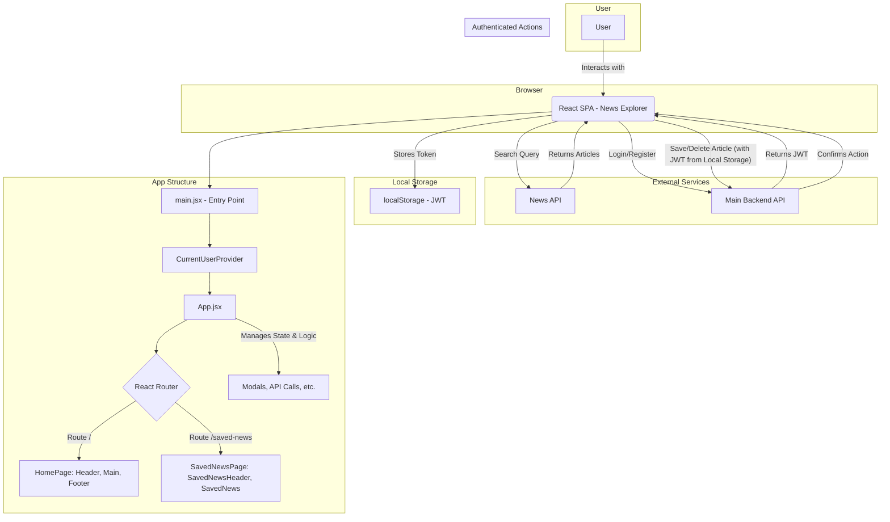

# News Explorer Frontend

[](https://github.com/ilyalyudevig/news-explorer-frontend/actions/workflows/playwright.yml)
[](https://github.com/ilyalyudevig/news-explorer-frontend/actions/workflows/deploy.yml)

This is the frontend for [News Explorer](https://news-explorer.info), a React-based web app for searching and saving news articles. It's built with a clean, modular architecture and follows a [Figma-based design spec](https://www.figma.com/design/3ottwMEhlBt95Dbn8dw1NH/Your-Final-Project?node-id=0-1&p=f&t=OIWocUqPQrdjeWJf-0).

## Description

News Explorer lets users search for recent news articles by keyword and save their favorites to a protected area. The UI is fully responsive, built with reusable React components, and adheres to modern CSS and JavaScript best practices.

## Getting Started

To get a local copy up and running, follow these simple steps.

### Prerequisites

- npm

  ```sh
  npm install npm@latest -g
  ```

### Installation

1. Clone the repo

   ```sh
   git clone https://github.com/ilyalyudevig/news-explorer-frontend.git
   ```

2. Install NPM packages

   ```sh
   npm install
   ```

3. Start the development server

   ```sh
   npm run dev
   ```

   The application will be available at `http://localhost:3000`.

## Available Scripts

In the project directory, you can run:

- `npm start`: Runs the app in development mode.
- `npm run dev`: Opens the app in a new browser tab.
- `npm run staging`: Runs the app in staging mode.
- `npm run build`: Builds the app for production.
- `npm run lint`: Lints the project files.
- `npm run preview`: Previews the production build.

## Testing

This project uses [Playwright](https://playwright.dev/) for end-to-end testing. The following test scripts are available:

- `npm test`: Runs all Playwright tests.
- `npm run test:staging-desktop-chrome`: Runs desktop tests on the staging environment.
- `npm run test:staging-mobile`: Runs generic mobile tests on the staging environment.
- `npm run test:staging-tablet`: Runs generic tablet tests on the staging environment.
- `npm run test:staging-mobile-chrome`: Runs tests on a mobile Chrome device profile.
- `npm run test:staging-mobile-safari`: Runs tests on a mobile Safari device profile.
- `npm run test:staging-tablet-chrome`: Runs tests on a tablet Chrome device profile.
- `npm run test:staging-tablet-safari`: Runs tests on a tablet Safari device profile.
- `npm run test:all-devices`: Runs tests across a wide range of mobile and tablet devices.
- `npm run test:ui`: Runs tests with the Playwright UI.
- `npm run test:debug`: Runs tests in debug mode.
- `npm run test:headed`: Runs tests in headed mode.

## Application Architecture

This is a **Single Page Application (SPA)** built with **React** and **Vite**. It uses `react-router-dom` for client-side routing and the React Context API for global state management. The application communicates with two external services: a third-party News API for fetching articles and a main backend API for user authentication and data persistence.



## Interesting Techniques

- **Custom React Hooks**: Encapsulates logic for API calls, form handling, and modal state.
- **Protected Routes**: Uses a higher-order component to restrict access to saved articles.
- **Context API**: Shares user state across components without prop drilling.
- **BEM CSS Methodology**: Organizes styles for scalability.
- **Vite for Fast Builds**: Uses [Vite](https://vitejs.dev/) for rapid development and optimized production builds.
- **CSS Normalize**: Ensures cross-browser consistency.

## Notable Technologies & Libraries

- [React](https://react.dev/)
- [React Router](https://reactrouter.com/)
- [Vite](https://vitejs.dev/)
- [Playwright](https://playwright.dev/)
- [ESLint](https://eslint.org/)
- [normalize.css](https://necolas.github.io/normalize.css/)
- [Inter font](https://rsms.me/inter/)
- [Roboto font](https://fonts.google.com/specimen/Roboto)

## Project Structure

```text
/public
/src
  /blocks
  /components
  /contexts
  /docs
  /hooks
  /images
  /utils
  /vendor
/tests
```

- **/public**: Static assets for the app.
- **/src/blocks**: CSS modules, organized by BEM.
- **/src/components**: Reusable React components.
- **/src/contexts**: React context providers.
- **/src/docs**: Project documentation and criteria.
- **/src/hooks**: Custom React hooks.
- **/src/images**: Image assets and SVGs.
- **/src/utils**: Utility functions and API logic.
- **/src/vendor**: Third-party styles and fonts.
- **/tests**: Playwright E2E test specs and states.
